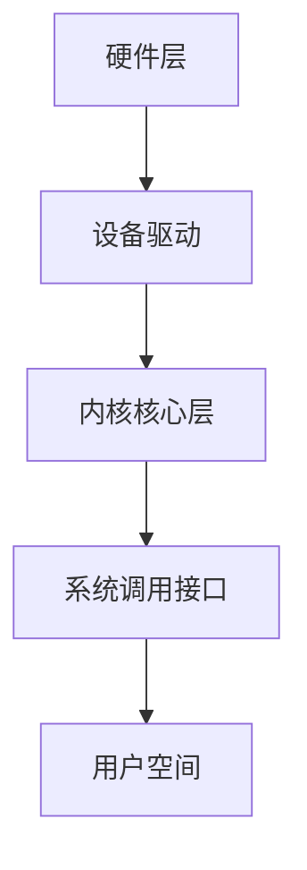

# Linux 系统调研文档

## 一、诞生背景与发展历史
- **1991年**：芬兰学生Linus Torvalds发布初版Linux内核（0.01版），目标为替代MINIX操作系统
- **关键驱动力**：
  - GNU项目已开发大量自由软件（GCC/Bash等），但缺少内核（Hurd未成熟）
  - 受Minix启发但需突破其许可证限制
  - 互联网协作开发模式（邮件列表）加速发展
- **里程碑版本**：
  - 1994年：Linux 1.0 发布（支持网络、文件系统等）
  - 1996年：2.0版支持SMP对称多处理
  - 2015年：4.0版支持热补丁

## 二、内核架构设计
### 1. 内核类型
**Linux是宏内核(Monolithic Kernel)**  
特点：
- 核心功能（进程管理、内存管理、文件系统等）均运行在内核空间
- 通过动态加载模块（.ko文件）扩展功能
- 与微内核对比：性能更高但耦合性更强

### 2. 模块分层架构

#### 层级说明：
1. **硬件层**  
   CPU/内存/外设等物理资源

2. **设备驱动层**  
   - 直接操作硬件的代码（如网卡驱动、文件系统驱动）
   - 通过中断/ DMA与硬件交互

3. **内核核心层**  
   包含五大核心子系统：
   - **进程调度**：CFS完全公平调度器
   - **内存管理**：Buddy分配器 + Slab缓存
   - **虚拟文件系统**（VFS）：抽象文件操作接口
   - **网络协议栈**：TCP/IP实现
   - **进程间通信**：信号/管道等机制

4. **系统调用接口**  
   - 提供`syscall`接口（如`open()` `read()`）
   - 用户态与内核态的唯一安全通道

### 3. 用户态与内核态
| **模式**       | 特权级别 | 访问权限                  | 典型场景               |
|----------------|----------|---------------------------|------------------------|
| **内核模式**   | Ring 0   | 直接访问硬件和全部内存    | 中断处理、驱动执行     |
| **用户模式**   | Ring 3   | 受限内存访问，需系统调用  | 应用程序运行（如Nginx）|

模式切换触发条件：
- 系统调用（软中断`int 0x80`或`syscall`指令）
- 硬件中断
- 异常（如缺页异常）

## 三、用户进程间通信（IPC）方式
| 方式          | 原理描述                     | 典型API               |
|---------------|------------------------------|-----------------------|
| **管道(Pipe)**| 单向字节流，父子进程间使用   | `pipe()`              |
| **命名管道(FIFO)** | 具名管道，支持非亲缘进程 | `mkfifo()`            |
| **信号(Signal)**  | 内核转发的异步通知       | `kill()`, `signal()`  |
| **共享内存**   | 映射同一物理内存区域         | `shmget()`, `shmat()` |
| **消息队列**   | 内核管理的结构化消息传递     | `msgget()`, `msgsnd()`|
| **套接字(Socket)** | 跨网络/主机的通信        | `socket()`, `bind()`  |
| **信号量(Semaphore)** | 进程间同步机制       | `sem_init()`          |

## 四、关键调用链示例（硬件访问流程）

用户程序调用write() 
→ 触发sys_write系统调用 
→ VFS层处理文件操作 
→ 文件系统驱动（如ext4） 
→ 块设备驱动（如SATA）
→ 通过MMIO/DMA操作磁盘控制器
→ 硬件执行写入操作

## 附录：内核源码目录结构
- `/arch`：CPU架构相关代码（x86, ARM等）
- `/drivers`：设备驱动程序（占代码量70%+）
- `/fs`：文件系统实现（ext4, procfs等）
- `/kernel`：核心子系统（调度、定时器等）
- `/mm`：内存管理实现
- `/net`：网络协议栈
