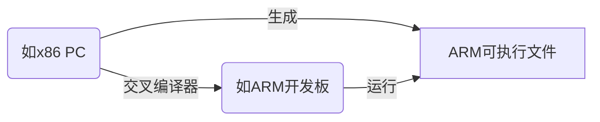
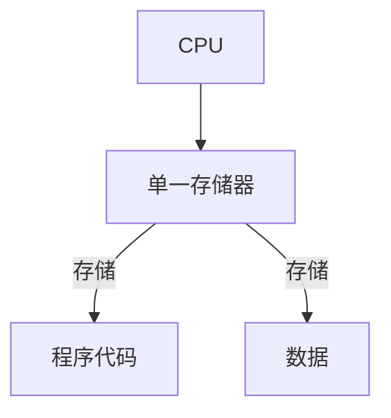
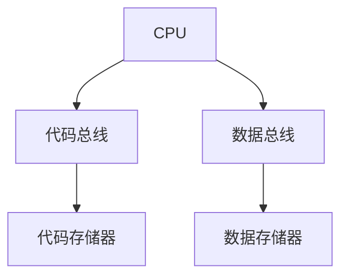
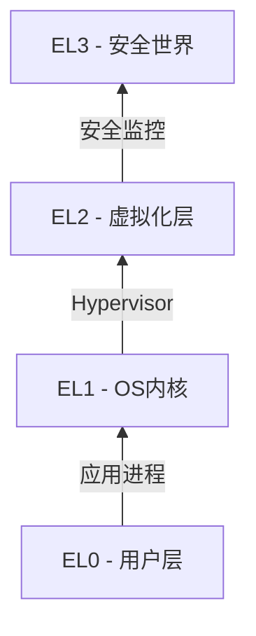

# ARM体系结构调研文档

## 一、NAND Flash与NOR Flash的区别

| **特性**          | **NAND Flash**               | **NOR Flash**              |
| ----------------- | ---------------------------- | -------------------------- |
| **结构**          | 串行连接（类似硬盘）         | 并行连接（类似RAM）        |
| **读取速度**      | 较慢（顺序读取）             | **较快**（随机访问）       |
| **写入/擦除速度** | **较快**（块操作）           | 较慢（字节操作）           |
| **接口**          | 复杂（需控制器）             | 简单（直接总线访问）       |
| **存储密度**      | **高**（适合大容量存储）     | 低（成本高）               |
| **寿命**          | 10万次擦写                   | 100万次擦写                |
| **典型应用**      | SSD/U盘/手机存储（eMMC/UFS） | BIOS/固件存储（XIP执行）   |
| **XIP支持**       | 不支持                       | **支持**（可直接执行代码） |

> **关键区别**：NOR适合存储需直接执行的代码（如bootloader），NAND适合大容量数据存储

## 二、CPU、MCU、SoC的区别

| **类型** | **全称**                | **定义**                       | **典型组成**                    | **应用场景**              |
| -------- | ----------------------- | ------------------------------ | ------------------------------- | ------------------------- |
| **CPU**  | Central Processing Unit | 中央处理器（仅计算核心）       | ALU+寄存器+控制单元             | 通用计算（PC/服务器）     |
| **MCU**  | Microcontroller Unit    | 微控制器（单芯片集成系统）     | CPU+RAM+ROM+外设(I2C/ADC等)     | 嵌入式控制（家电/传感器） |
| **SoC**  | System on Chip          | 片上系统（高度集成的复杂系统） | 多核CPU+GPU+RAM+基带+专用加速器 | 手机/物联网/车载系统      |

**关系演进**：
```
CPU（纯处理器） → MCU（CPU+基础外设） → SoC（CPU+专用硬件+复杂子系统）
```

## 三、交叉编译（Cross Compilation）

### 定义
在**平台A**上编译生成能在**平台B**上运行的可执行文件的过程

### 核心要素


### 典型场景
1. **嵌入式开发**：x86 PC上编译ARM/Linux程序
2. **操作系统开发**：编译不同架构的内核
3. **跨平台应用**：开发iOS/Android应用

### 工具链组成
- **交叉编译器**（如`arm-linux-gnueabihf-gcc`）
- **链接器**（处理目标架构的二进制格式）
- **库文件**（目标平台的系统库）

## 四、冯诺依曼结构与哈佛结构

### 冯诺依曼结构（Von Neumann Architecture）

- **特点**：代码和数据共享同一存储空间与总线
- **优势**：硬件设计简单
- **瓶颈**："冯诺依曼瓶颈"（取指与数据访问冲突）
- **应用**：x86/ARM Cortex-A系列

### 哈佛结构（Harvard Architecture）

- **特点**：代码与数据存储分离，独立总线访问
- **优势**：并行访问提升性能，避免总线冲突
- **应用场景**：DSP/单片机/ARM Cortex-M系列

### 现代架构融合
- **改进型哈佛结构**：物理存储分离，但通过缓存统一访问（如ARM处理器）
- **示例**：ARM CPU的L1缓存分为指令缓存(I-Cache)和数据缓存(D-Cache)

## 五、ARM异常等级（Exception Levels）

### 权限层级模型


### 等级说明
| **等级** | **名称**     | **特权级别** | **运行内容**           | 典型软件              |
| -------- | ------------ | ------------ | ---------------------- | --------------------- |
| **EL0**  | 用户模式     | 最低         | 普通应用程序           | Linux用户进程         |
| **EL1**  | 操作系统内核 | 中等         | 操作系统内核           | Linux内核/Windows内核 |
| **EL2**  | 虚拟机监控器 | 高           | 虚拟化管理程序         | KVM/Xen Hypervisor    |
| **EL3**  | 安全监控层   | 最高         | 安全世界与普通世界切换 | ARM TrustZone固件     |

### 关键特性
1. **权限隔离**：EL0无法直接访问硬件资源
2. **层级切换**：通过异常/中断触发等级提升
   - 例如：用户程序调用系统调用 → 从EL0进入EL1
3. **虚拟化支持**：EL2运行Hypervisor管理多个EL1客户OS
4. **安全扩展**：EL3处理安全世界（TrustZone）与非安全世界切换

> **应用实例**：手机系统中Android应用运行在EL0，Linux内核在EL1，Hypervisor在EL2，加密服务在EL3的TrustZone环境
